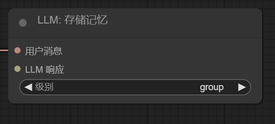
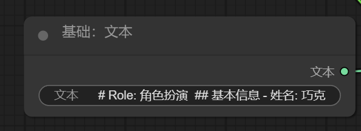

# `Block `相关概念

`Block`对象是工作流执行操作的最小单位，其在工作流中与其余工作流以线相连构成一个完整的工作流程


### 主要属性介绍

[uml类图](## 类图)

类属性：

- `name：str`            - 一个字符串用以命名该块
- `inputs: dict`     - 用以设定块接收的输入
- `outputs: dict ` - 用以设定块的输出

```python
from kirara_ai.workflow.core.block import Block, Input, Output

"""
# Input类参数总览
Input(name: str, lable: str, data_type: type, description: str, nullable: bool = False, default: Optional[Any] = None)

- name: 该输入项的名称
- lable: 该项将会显示在workflow的块上作为输入标识符
- data_type: 输入期望的类型，如果Input和Output类型不相同将会拒绝连线
- description: 该项的描述，建议使用简要语句说出该输入的主要内容
- nullable：该输入项是否可以为空，当你使用了多个输入项但是不是每次块被执行时输入项都有值时建议设置为True
- default: 当nullable为True时，遇到输入数据为空时为其赋予一个默认值

# Output类参数总览
Output(name: str, lable: str, data_type: dict, description: str)
"""

class CustomBlock(Block):
    name = "a block"
    # 不同块之间本质是使用解包符号**dict传递参数。此时字典键值对将作为关键字参数传递。
    inputs = {
        # 当你想要使用更多的类型时请使用pydantic定义类型
        "resp": Input("example_input", "输入", str, "这是描述", nullable = True)
        "sender": Input("im_send", "im输入", IMMessage, "接收qq群等的消息", True, None)
    }
    outputs = {
        "msg": Output("msg", "输出", str, "这是一个描述")
    }
    container: DenpendencyContainer # 注意这是一个类型标注，并非赋值语句
```


## `Block`对象初始化

当`Block`对象被初始化时将会对该对象注入部分属性

- `container`: 本`workflow`实例的作用域容器 

在`Block`对象中使用self.container调用该容器

> [!IMPORTANT]
>
> `container`被注入时间位于`__init__()`方法之后，如果你在`__init__()`方法中调用此属性会抛出异常，因为此时该属性为`None`

## `Block`对象初始化

你已经注意到了网页中的工作流有一些配置选项。

例如：

- 单选配置项



- 文本框配置项

  

- 多选配置项

  `ps`: 即将推出

下面将介绍如何接收这些参数

```python
from kirara_ai.workflow.core.block import Block, ParamMeta
from typing import Annotated

def provide_color_select_items() -> list:
    return ["read", "green", "black"]

def provide_feature_items() ->list:
    return [True, False]

class MyBlock(Block):
    #剩余代码
    def __init__(
        self,
        text: str,
        color: Annotated[
            Optional[str],
            ParamMeta(lable="颜色", description="这个参数选择颜色", option_provider = provide_color_select_items()) = "red"
        ]
    ):
     self.text = text
     self.selected = color
    #剩余代码
```

其中:

- `__init__()`是用来接收前端传递的配置项，如果你不需要接收参数可以不用声明`__init__()`函数。

- `ParamMeta` 用以在网页展示这个配置项的一些功能：

  - `label`参数内容将展示在网页上, 应当尽可能在字数少的情况下清晰描述该参数 
  - `description` 参数内容应当为这个参数的详细描述
  - `option_provider` 参数期望一个包含各个选项列表

- 基本用法使用Annotated[type, ParamMeta] 完成字段的类型标记。


## `Block`对象执行部分

```python
from kirara_ai.workflow.core.block import Block, Input, Output

class MyBlock(Block):
    name = "测试块"
    inputs = {
        "stdin": Input(lable="stdin", str, description="测试输入", nullable = False, default = "helloworld")
    }
    outputs = {
        "stdout": Output(lable="stdout", str, description="测试输出")
    }
    
    # 第一种写法
    def execute(self, **kwags) -> dict[str,Any]:
        # 从kwags字典中获取对应参数, 键为类属性inputs中的键
        stdin = kwags.get("stdin", None)
        
        # return的对象为一个字典。键应当为类属性outputs中的键。
        return {"stdout": "hello world"}
    
    # 第二种写法
    def execute(self, stdin) -> dict[str, Any]:
        # 本质上工作流调度器相当于将上一个块的返回值字典使用**解包为一系列关键字参数，所以在execute中写上与类属性inputs的键相同的值就可以收到对应参数。
        return {"stdout": stdin}
```


## `Block`对象被注入的属性

- `self.container: DependencyContainer` 

  ​	当前工作流的作用域容器，能够让你存储一些状态，完成有状态的`Block`设计。再次强调，在新版本中`Block`执行后即刻被`gc`，所以不要在Block中存储状态。`Container`具体用法[参见](../container.md)
